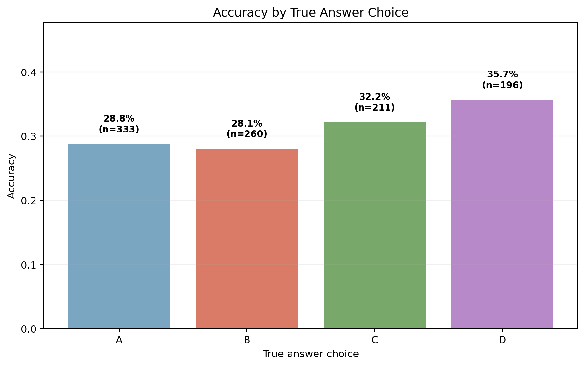

# Clinical NLP with Biomedical Text Data
**Course Project 3 — Multi-Class Text Classification on Medical Questions**

## Project Description
This project implements a natural language processing (NLP) text classification pipeline applied to biomedical data. We formulate a multiple-choice medical question answering (MCQA) task as a multi-class text classification problem.

Each question is paired with four candidate answer choices, and the model is trained to classify which answer is correct by evaluating each (question, answer choice) pair and selecting the most probable class among four labels (A, B, C, D).

Three modeling approaches are compared: a bidirectional LSTM baseline trained from scratch, and two pretrained transformer models (DistilBERT and BERT), all evaluated on the same dataset splits.

## Assignment Compliance
- Implements a **supervised multi-class text classification NLP algorithm**
- Biomedical text source: **MedMCQA** (`openlifescienceai/medmcqa`)
- Target labels/classes: **A, B, C, D** (4-class classification)
- Includes: data loading, preprocessing/tokenization, training, validation, evaluation, error analysis, EDA, confusion matrix, training curves, and reproducibility artifacts
- Includes both a **required RNN/LSTM baseline** and **pretrained transformer models**

## Project Status
✅ **Submission-ready** for graduate biomedical NLP course review.

## Project Structure
```text
project_root/
├── figures/                        # Generated plots per model
│   ├── lstm/
│   │   ├── eda/                    # EDA figures
│   │   ├── confusion_matrix.png
│   │   ├── error_breakdown.png
│   │   ├── subject_accuracy.png
│   │   └── training_curves.png
│   ├── distilbert-base-uncased/
│   │   ├── eda/
│   │   ├── confusion_matrix.png
│   │   ├── error_breakdown.png
│   │   ├── subject_accuracy.png
│   │   └── training_curves.png
│   ├── bert-base-uncased/
│   │   ├── eda/
│   │   ├── confusion_matrix.png
│   │   ├── error_breakdown.png
│   │   ├── subject_accuracy.png
│   │   └── training_curves.png
│   └── model_comparison.png
├── outputs/                        # Run artifacts per model
├── reports/
│   └── final_report.md
├── src/
│   ├── data.py                     # Dataset loading & preprocessing (James Garner)
│   ├── model.py                    # Model & tokenizer initialization (Pascual Jahuey)
│   ├── train.py                    # Training pipeline (Pascual Jahuey)
│   ├── evaluate.py                 # Evaluation, error analysis, plots (Riley Bendure)
│   ├── eda.py                      # Exploratory data analysis (Riley Bendure)
│   ├── lstm_model.py               # BiLSTM baseline model (Riley Bendure)
│   ├── tokenization_report.py      # Tokenization documentation (Riley Bendure)
│   ├── utils.py                    # Shared utilities
│   └── main.py                     # End-to-end runner + model comparison (Pascual Jahuey)
├── requirements.txt
└── README.md
```

## Team Roles
| Member | Responsibilities |
|---|---|
| **Carolina Horey** | Introduction, Literature Review, Clinical Framing, Discussion |
| **James Garner** | Dataset loading, preprocessing pipeline, label validation, data documentation (`src/data.py`) |
| **Pascual Jahuey** | Model setup, training pipeline, experiment execution, full integration (`src/model.py`, `src/train.py`, `src/main.py`) |
| **Riley Bendure** | LSTM baseline, evaluation, EDA, error analysis, figures/tables, tokenization docs, README polish (`src/evaluate.py`, `src/lstm_model.py`,`src/eda.py`) |

## Neural Modeling Approaches

### LSTM Baseline
| Architecture | Tokenizer | Embeddings | Unknown Tokens | Padding | Prediction Head |
|---|---|---|---|---|---|
| Bidirectional LSTM, 2 layers, hidden size 256, embedding dim 128 | BERT WordPiece tokenizer, vocab size 30,522 | Learned from scratch with `nn.Embedding` | BERT `[UNK]` token, id 100 | Packed sequences ignore padding during the forward pass | `Linear(hidden_dim * 2, 1)` per choice over mean-pooled LSTM output |

### Pretrained Transformer Models
| Model | Layers | Parameters | Tokenizer | Fine-tuning |
|---|---:|---:|---|---|
| `distilbert-base-uncased` | 6 | 66M | WordPiece, `padding="max_length"`, truncation, max length 128 | `AutoModelForMultipleChoice` with AdamW optimizer |
| `bert-base-uncased` | 12 | 110M | WordPiece, `padding="max_length"`, truncation, max length 128 | `AutoModelForMultipleChoice` with AdamW optimizer |

### Hyperparameters
| Parameter | Value |
|---|---:|
| Learning rate | `2e-5` |
| Batch size | `8` |
| Epochs | `3` |
| Max sequence length | `128` |
| Warmup ratio | `0.1` |
| Weight decay | `0.01` |
| Seed | `42` |

## Clinical Context
MedMCQA covers 21 medical subjects (anatomy, pathology, pharmacology, surgery, etc.). This project explores biomedical reasoning in a structured classification setting useful for educational decision support and benchmark-oriented clinical NLP evaluation.

## Dataset Description
**MedMCQA**: https://huggingface.co/datasets/openlifescienceai/medmcqa

- Task: 4-way medical multiple-choice classification
- Labels: A, B, C, D
- Fields used: `question`, `opa`, `opb`, `opc`, `opd`, `cop`, `subject_name`
- Default subset: 5,000 training + 1,000 validation samples (configurable)
- Average question length: 12.7 words

## Data Processing Details

MedMCQA examples are tokenized as four (`question`, option) pairs:
- (`question`, `opa`)
- (`question`, `opb`)
- (`question`, `opc`)
- (`question`, `opd`)

The correct answer label is stored in `cop`, where:
- 0 = A
- 1 = B
- 2 = C
- 3 = D

In the current pipeline, preprocessing uses the dataset's `question` and answer choice fields (`opa`-`opd`) to build model inputs, and `cop` is read as the target label. Additional sanitization steps such as string normalization, whitespace trimming, or explicit validation of non-empty answer choices and label ranges are not currently documented as part of this preprocessing stage.

## Setup Instructions
> Recommended Python version: **Python 3.12** 

### 1) Clone repository
```bash
git clone https://github.com/Pjahuey/Clinical-NLP-with-Biomedical-Text-Data.git
cd Clinical-NLP-with-Biomedical-Text-Data
```

### 2) Create and activate virtual environment
```bash
python -m venv venv
source venv/bin/activate                    # Linux/macOS
venv\Scripts\activate.bat                  # Windows (Command Prompt)
# or: .\venv\Scripts\activate.bat         # Windows PowerShell
```

### 3) Install dependencies
```bash
pip install -r requirements.txt
```

## Quick Start
# Run all three models
```bash
python -m src.main --compare_models
```
# Single model
```bash
python -m src.main --model lstm
python -m src.main --model distilbert
python -m src.main --model bert
```
# Smoke test
```bash
python -m src.main --compare_models --epochs 1 --train_size 100 --val_size 50
```

Or with helper scripts:
```bash
./run_experiment.sh
# Windows:
run_experiment.bat
```


### CLI Arguments
| Argument | Type | Default | Description |
|---|---|---|---|
| `--model` | `str` | `distilbert-base-uncased` | Single model name/alias or comma-separated model list |
| `--compare_models` | `flag` | `False` | Runs `distilbert-base-uncased` and `bert-base-uncased` and `lstm` together |
| `--epochs` | `int` | `3` | Number of training epochs |
| `--batch_size` | `int` | `8` | Per-device training batch size |
| `--eval_batch_size` | `int` | `16` | Per-device evaluation batch size |
| `--learning_rate` | `float` | `2e-5` | AdamW learning rate |
| `--train_size` | `int` | `5000` | Training subset size |
| `--val_size` | `int` | `1000` | Validation subset size |
| `--max_length` | `int` | `128` | Max token length per (question, option) pair |
| `--output_dir` | `str` | `outputs` | Output Directory |
| `--figure_dir` | `str` | `figures` | Directory for generated figures |
| `--seed` | `int` | `42` | Random seed |

## Outputs
After each run, artifacts are automatically saved:

| File / Folder | Description |
|---|---|
| `outputs/config.json` | Full run configuration |
| `outputs/metrics.json` | Accuracy, macro precision/recall/F1 |
| `outputs/predictions.csv` | Per-example predictions |
| `outputs/correct_examples.csv` | Sample correct predictions |
| `outputs/incorrect_examples.csv` | Sample incorrect predictions |
| `outputs/subject_accuracy.csv` | Subject-wise accuracy (if available) |
| `outputs/model_comparison.csv` | Side by side model metrics |
| `outputs/model_comparison.png` | Model comparison bar chart |
| `figures/<model>/confusion_matrix.png` | Confusion matrix per model |
| `figures/<model>/training_curves.png` | Train/val loss curves per model |
| `figures/<model>/error_breakdown.png` | Correct vs incorrect counts |
| `figures/<model>/subject_accuracy.png` | Subject-wise accuracy |
| `figures/<model>/eda` | EDA figures |
| `figures/model_comparison_delta.png` | Accuracy improvement over the 25% random baseline |
| `figures/top_bottom_subjects.png` | Highest and lowest subject accuracies with sample sizes |
| `figures/accuracy_by_answer_choice.png` | Accuracy split by true answer choice |
| `figures/accuracy_vs_sample_size.png` | Subject accuracy reliability by sample size |
| `figures/confusion_matrix.png` | Normalized A/B/C/D confusion matrix from existing predictions |
| `figures/prediction_distribution.png` | True vs predicted answer-choice distribution |
| `reports/error_analysis_table.md` | Representative incorrect examples with likely error types |

When running two models:

| File / Folder | Description |
|---|---|
| `outputs/model_comparison.csv` | Side-by-side model metrics summary |
| `outputs/readme_placeholders.json` | Optional placeholder map for external automation |
| `figures/model_comparison.png` | Model comparison bar chart with 25% random baseline |

## Results Summary
| Model | Accuracy | Precision (macro) | Recall (macro) | F1 (macro) |
|---|---:|---:|---:|---:|
| BERT-base-uncased | 30.70% | 31.06% | 31.21% | 30.55% |
| DistilBERT-base-uncased | 30.30% | 30.46% | 31.11% | 30.30% |
| LSTM (BiLSTM baseline) | 26.10% | 26.48% | 26.36% | 25.92% |
| Random baseline | 25.00% | -- | -- | -- |
Best model: **bert-base-uncased**

Random baseline (4-class uniform): **25.0%**

## Figure-Based Key Findings

### Model Performance vs Baseline


BERT reaches 30.7% validation accuracy, about 5.7 percentage points above the 25% random baseline. DistilBERT is close behind at 30.3%, so the transformer models improve over chance but remain challenged by medical reasoning questions.

### Subject-Level Strengths and Weaknesses


Subject accuracy varies substantially across medical domains. Psychiatry appears highest, but it has only n=3 examples, so that result should be interpreted cautiously rather than treated as evidence of strong domain performance.

### Sample Size and Reliability


The scatter plot shows why small subject groups can produce unstable accuracy estimates. Larger subjects such as Dental provide more reliable aggregate signals, while very small subjects can swing sharply from one or two examples.

### Confusion Matrix


The normalized confusion matrix shows where the best available run confuses answer choices A, B, C, and D. Off-diagonal mass indicates that the model often selects a plausible distractor rather than the correct option.

### Prediction Distribution


The true labels are not perfectly balanced, and the model predicts choice D more often than it appears in the validation labels. This suggests a mild answer-choice bias that should be considered when interpreting aggregate accuracy.

## Synthesis of Findings
- BERT improves over the 25% random baseline by 5.7 percentage points, which is meaningful but modest given its larger capacity.
- All neural models exceed the random baseline, confirming that the models learn signal from the biomedical question-answer pairs rather than guessing uniformly.
- The narrow BERT vs DistilBERT gap suggests that model capacity alone is not the main constraint in this setup.
- Confusion-matrix structure and answer-choice bias show systematic errors, especially plausible distractor selection and overprediction of answer choice D.
- Subject-wise variation, especially small-n subjects such as Psychiatry, should be interpreted cautiously because a few examples can strongly affect accuracy.
- Overall, performance appears constrained by biomedical domain difficulty, limited subset size, and answer-choice ambiguity more than by implementation mechanics.

## Quick Advanced Analysis





- The model overpredicts answer choice D relative to the validation labels: 279 D predictions vs 196 true D labels.
- Accuracy by true answer choice is highest for D at 35.7% and lowest for B at 28.1%.
- Using `subject_accuracy.csv`, the strongest subjects are Psychiatry, Anaesthesia, ENT, Physiology, and Ophthalmology.
- The weakest subjects are Orthopaedics, Skin, Microbiology, Pathology, and Radiology, with the very small n subjects requiring caution.
- The representative incorrect examples suggest common issues with negation wording, dense clinical stems, and plausible medical distractors. See [reports/error_analysis_table.md](reports/error_analysis_table.md).

## Error Analysis
Most errors involve semantically similar options, negation questions ("which is NOT true"), long question stems, and rare medical terminology where shallow lexical overlap is insufficient for correct reasoning.

| Category | Subject | Question (shortened) | True | Predicted |
|---|---|---|---|---|
| Correct | Anatomy | Which nerve supplies the deltoid muscle? | C | C |
| Correct | Pharmacology | First-line treatment for anaphylaxis is: | A | A |
| Correct | Pathology | Reed-Sternberg cells are associated with: | B | B |
| Incorrect | Biochemistry | Rate-limiting enzyme of glycolysis is: | A | C |
| Incorrect | Physiology | Primary determinant of pulse pressure is: | D | B |
| Incorrect | Microbiology | Most common cause of lobar pneumonia is: | B | A |

## Reproducibility Notes
- Deterministic seeds are set for Python, NumPy, and PyTorch.
- Subset selection uses deterministic indexing (`select(range(N))`).
- Run settings are saved to `config.json` for each execution.
- Output and figure directories are created automatically.

Current submitted HiperGator result artifacts are preserved at the repository root so the analysis scripts can read the same CSV/JSON files used for the report. Future generated run artifacts should be written under `outputs/`, which is ignored by Git except for its placeholder.

## What This Project Demonstrates
- A complete supervised biomedical text classification workflow using MedMCQA as a four-class MCQA benchmark.
- A direct comparison between a learned-from-scratch LSTM baseline and pretrained transformer multiple-choice models.
- Reproducible experiment configuration, deterministic subset selection, and report-ready artifact generation.
- Model behavior analysis beyond raw accuracy, including confusion patterns, subject-level variation, answer-choice bias, and representative errors.
- Evidence that general-domain pretrained models remain limited on biomedical MCQA without domain-specific pretraining or larger task-specific training.

## Limitations
- Accuracy depends on the selected subset size, number of epochs, and model choice.
- The LSTM baseline does not benefit from pretrained contextual representations.
- Performance is benchmark-oriented and does not imply clinical deployment readiness.
- Domain-specific models such as BioClinicalBERT or PubMedBERT may improve results.

## References
1. Devlin, J., et al. BERT: Pre-training of Deep Bidirectional Transformers for Language Understanding (2019).
2. Sanh, V., et al. DistilBERT, a distilled version of BERT (2019).
3. Pal, A., et al. MedMCQA: A Large-scale Multi-Subject Multi-Choice Dataset for Medical QA (2022).
4. Wolf, T., et al. Transformers: State-of-the-Art Natural Language Processing (2020).
5. Hugging Face Datasets: MedMCQA card — https://huggingface.co/datasets/openlifescienceai/medmcqa

## License
This project is for educational purposes. MedMCQA is distributed under its own license; see the dataset card for details.


