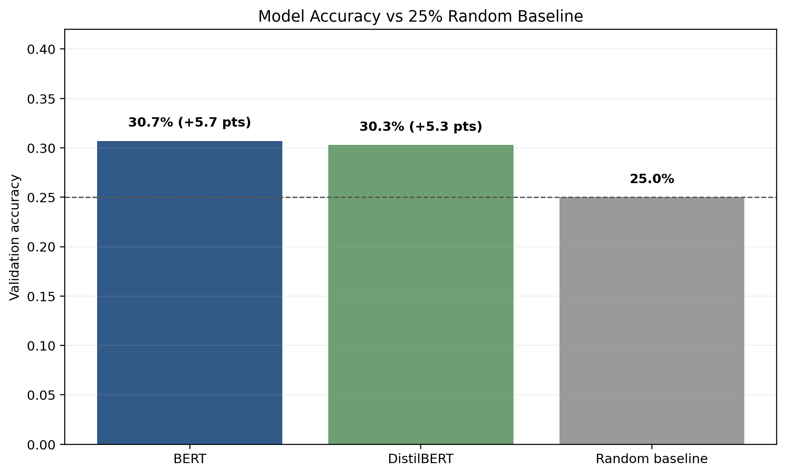
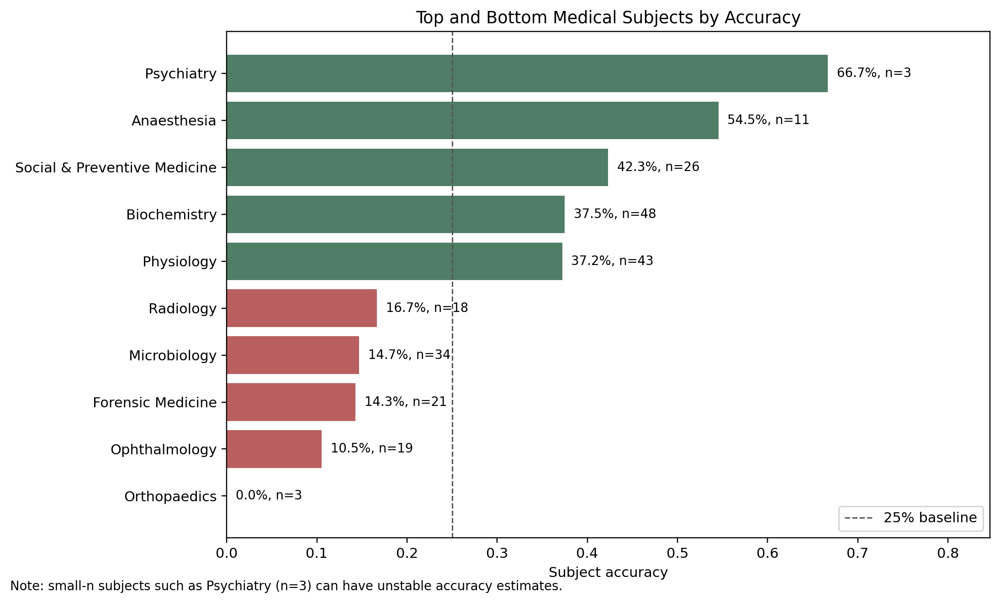
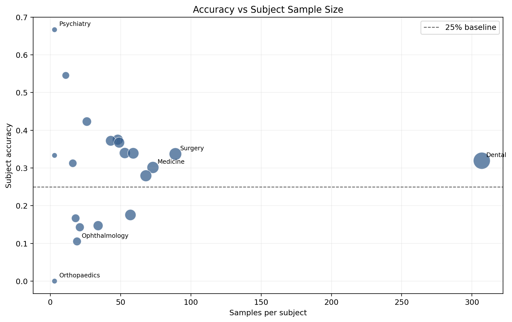
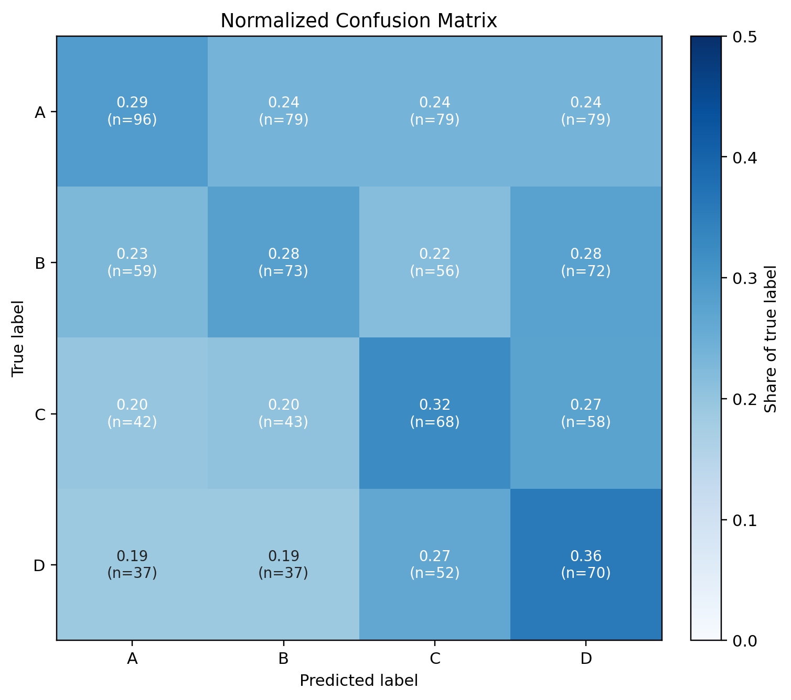
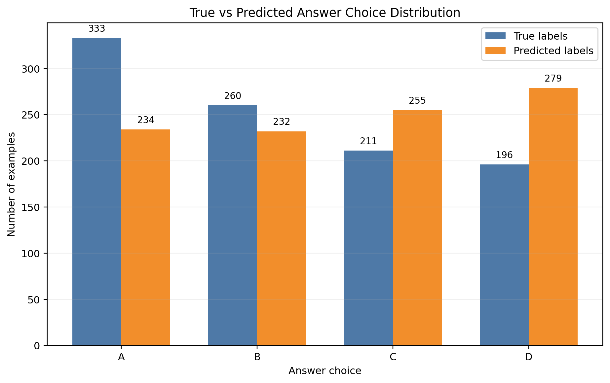

# Final Report: Clinical NLP with Biomedical Text Data

## Abstract
This project presents a supervised multi-class text classification NLP algorithm for biomedical question understanding using MedMCQA. We frame multiple-choice medical question answering as a four-class prediction task over answer labels A, B, C, and D. We compare pretrained transformer models (DistilBERT and BERT) with a bidirectional LSTM baseline using deterministic train/validation subsets, standardized tokenization, and reproducible experiment settings. The pipeline produces quantitative metrics, prediction-level artifacts, subject-wise analysis, and comparison outputs to support transparent evaluation. Results show that pretrained transformer encoders provide practical performance for biomedical multiple-choice classification while preserving a modular workflow suitable for further clinical NLP experimentation.

## Introduction
Biomedical NLP systems are increasingly used to support educational and clinical reasoning workflows. Medical multiple-choice question answering is a useful proxy task for measuring domain-specific language understanding, factual recall, and contextual reasoning. In this project, we address MedMCQA as a text classification problem rather than a generative QA task. This framing enables reliable supervised learning and clear metric interpretation.

Our objective is to build a complete, reproducible NLP pipeline that meets graduate course expectations: data ingestion, preprocessing, transformer fine-tuning, quantitative evaluation, qualitative error analysis, and transparent reporting. We preserve direct clinical relevance by using a benchmark containing medical subjects such as anatomy, pathology, pharmacology, and surgery.

## Literature Review
Pretrained language models established strong baselines for NLP through large-scale self-supervised pretraining followed by task-specific fine-tuning. BERT introduced bidirectional transformer representations that improved many classification benchmarks. DistilBERT reduced model size and latency while retaining most of BERT’s language performance, making it attractive for resource-constrained training.

In biomedical NLP, domain tasks benefit from transfer learning even when source pretraining is general-domain, especially with structured downstream supervision and carefully designed input formatting. MedMCQA offers a large-scale biomedical benchmark with real exam-style distractors and varied subject coverage, making it suitable for multi-class clinical text classification experiments.

Hugging Face Datasets and Transformers provide a reproducible interface for loading MedMCQA and fine-tuning standard multiple-choice heads. This project builds on that ecosystem to produce standardized artifacts and direct model comparisons for educational evaluation.

## Methods
### Task Formulation
- **Problem type**: supervised multi-class text classification NLP algorithm.
- **Input**: one question and four candidate options.
- **Output label**: one class among **A, B, C, D**.

### Dataset
- **Source**: MedMCQA (`openlifescienceai/medmcqa`) via Hugging Face.
- **Splits used**: train and validation.
- **Default subset sizes**: 5,000 train and 1,000 validation samples (configurable).

### Preprocessing and Encoding
Each example is transformed into four (question, option) pairs and tokenized with a Hugging Face tokenizer using truncation and fixed-length padding. Labels are mapped from the dataset index field (`cop`) to class IDs 0–3.

### Models
- `distilbert-base-uncased`
- `bert-base-uncased`
- `lstm`

DistilBERT and BERT are trained through `AutoModelForMultipleChoice`. The LSTM baseline is a custom bidirectional LSTM multiple-choice model trained with the same dataset formatting for comparison under consistent hyperparameters.

### Training and Reproducibility
Training uses the Hugging Face `Trainer` API with deterministic seeding for Python, NumPy, and PyTorch. Configuration is saved to `outputs/config.json` at runtime. The pipeline validates model names and subset sizes, and automatically creates output folders.

## Results
The strongest available run is BERT-base-uncased at 30.7% validation accuracy, compared with 30.3% for DistilBERT and a 25.0% random baseline. BERT therefore improves over chance by about 5.7 percentage points, while DistilBERT improves by about 5.3 points. The absolute accuracy remains modest, which is expected for medical multiple-choice reasoning with limited training examples and short fine-tuning.

Subject-level results show substantial variability across medical domains. Psychiatry appears highest, but it has only n=3 validation examples, so it should not be overclaimed as a reliable strength. Larger groups such as Dental provide more stable aggregate estimates, while small-n subjects can move sharply with only one changed prediction.

The relationship between sample size and accuracy highlights reliability concerns. Low-sample subjects can appear at the top or bottom of the ranking because their estimates are noisy, so subject-wise results should be interpreted together with n.

The normalized confusion matrix shows that errors are distributed across the A/B/C/D choices rather than isolated to one label. This supports the qualitative error pattern: many misses involve plausible distractors rather than obviously unrelated answers.

The prediction distribution indicates a mild bias toward predicting D more often than it appears in the true labels. This bias is not large enough to explain all errors, but it is useful diagnostic context when interpreting aggregate accuracy.

## Evaluation and Error Analysis
Evaluation includes accuracy, macro precision, macro recall, and macro F1. In addition to aggregate metrics, prediction-level outputs enable analysis of representative successes and failures. Subject-level aggregation (`subject_accuracy.csv`) highlights uneven performance across medical domains and supports targeted follow-up experiments.

Common observed error patterns in this setup include:
- semantically close distractor options,
- negation or "not true" question wording,
- long or information-dense question stems,
- specialty-specific terminology not strongly represented in the selected training subset.

## Discussion
This project demonstrates that biomedical multiple-choice QA can be implemented as a clear text classification workflow with reusable components and reproducible outputs. The approach balances practicality and interpretability: each prediction corresponds to one of four explicit classes, and outputs are structured for auditing. Comparing transformer models against an LSTM baseline supports discussion of the trade-off between pretrained contextual representations and a simpler recurrent architecture.

## Limitations
- Current experiments rely on configurable subsets rather than full MedMCQA training scale.
- The LSTM baseline is included, but its learned-from-scratch embeddings limit performance relative to pretrained transformer encoders.
- Metrics are validation-focused and do not include full held-out test benchmarking.
- Clinical deployment conclusions are limited because this is a course project benchmark study, not a patient-care system validation.

## Conclusion
The repository now provides a polished, submission-ready biomedical NLP project centered on a supervised four-class text classification algorithm over MedMCQA. It includes clear setup and execution steps, robust artifact generation, reproducible experiment configuration, model comparison support, and structured reporting outputs suitable for graduate coursework submission.

## Team Contributions
- **Carolina Horey**: Introduction framing, literature synthesis direction, clinical context, discussion guidance.
- **James Garner**: Dataset loading, preprocessing pipeline, label validation, data module implementation.
- **Pascual Jahuey**: Model setup, training pipeline, full experiment integration, reproducibility and comparison orchestration.
- **Riley Bendure**: Evaluation logic, metrics reporting, error analysis outputs, result artifact polish and interpretation support.

## References
1. Devlin, J., Chang, M.-W., Lee, K., & Toutanova, K. (2019). BERT: Pre-training of Deep Bidirectional Transformers for Language Understanding. *NAACL-HLT*.
2. Sanh, V., Debut, L., Chaumond, J., & Wolf, T. (2019). DistilBERT, a distilled version of BERT: Smaller, faster, cheaper and lighter. *NeurIPS EMC2 Workshop*.
3. Pal, A., Umapathi, L. K., & Sankarasubbu, M. (2022). MedMCQA: A Large-scale Multi-Subject Multi-Choice Dataset for Medical Domain Question Answering. *CHIL*.
4. Wolf, T., et al. (2020). Transformers: State-of-the-Art Natural Language Processing. *EMNLP: System Demonstrations*.
5. Lhoest, Q., et al. (2021). Datasets: A Community Library for Natural Language Processing. *ACL Demo*.
6. Hugging Face. MedMCQA dataset card. https://huggingface.co/datasets/openlifescienceai/medmcqa
7. Hugging Face Transformers documentation. https://huggingface.co/docs/transformers

